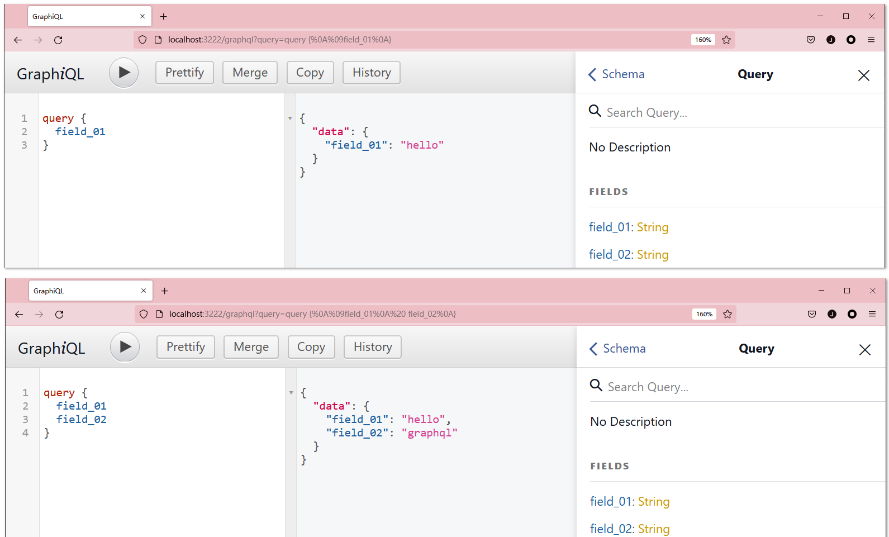

```js
const express = require("express");
const { buildSchema } = require("graphql");
const { graphqlHTTP } = require("express-graphql");
const schema = buildSchema(`
  type Query {
    field_01: String,
    field_02: String,
 }
`);
const root = {
  field_01: () => {
    return "hello";
  },
  field_02: () => {
    return "graphql";
  },
};

const app = express();

app.use(
  "/graphql",
  graphqlHTTP({
    schema: schema,
    rootValue: root,
    graphiql: true, // 启用调试
  }),
);

app.listen(3222);

```



`graphql-express` ： graphql 和 express 的中间件

`graphql` ： graphql 核心


最基本的， `graphqlHTTP` 方法传入一个对象， 其中  有一个字段 `schema` ，还有字段 `rootValue` 

`schema` 通过 graphql 核心提供的 `buildSchema` 方法构建， 传入一个字符串模板，定义了数据结构和类型

`rootValue` 就是一个方法集合对象，对象中每个方法名就是 `schema` 中对应的字段名。方法最终返回的值类型和 `schema` 中定义的值类型保持一致。 