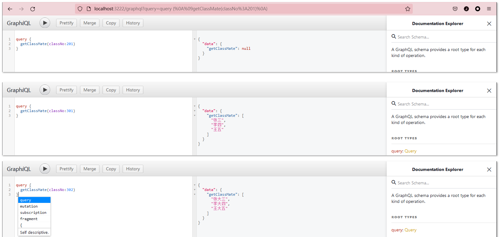

- 和 js 传递参数一样， 小括号内定义形参，但是注意： 参数需要定义类型

- `!` 代表参数不能为空

  示例：

  ```js
  const express = require("express");
  const { buildSchema } = require("graphql");
  const { graphqlHTTP } = require("express-graphql");
  const schema = buildSchema(`
    type Query {
      getClassMate(classNo: Int!): [String]
   }
  `);
  
  const root = {
    // 从arguments 中解构
    getClassMate({ classNo }) {
      const obj = {
        301: ["张三", "李四", "王五"],
        302: ["张大三", "李大四", "王大五"],
      };
      return obj[classNo];
    },
  };
  
  const app = express();
  
  app.use(
    "/graphql",
    graphqlHTTP({
      schema: schema,
      rootValue: root,
      graphiql: true,
    }),
  );
  
  app.listen(3222);
  
  ```

  