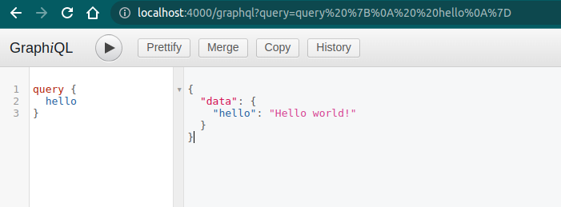
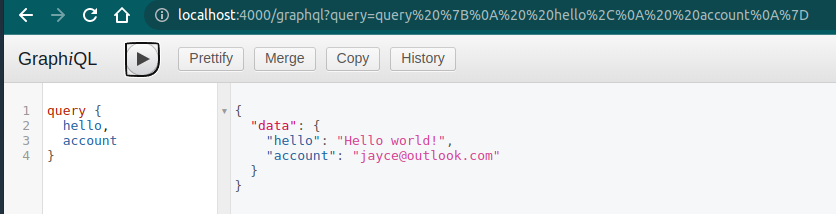
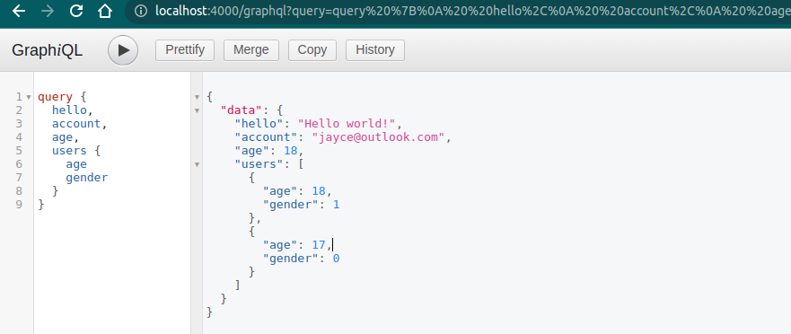

```js
var express = require('express');
var { graphqlHTTP } = require('express-graphql');
var { buildSchema } = require('graphql');

//　构建 schema, 这里定义查询语句和类型
// Construct a schema, using GraphQL schema language
var schema = buildSchema(`
  type Query {
    hello: String
  }
`);
// 定义查询所对应的 resolver, 也就是查询对应的处理器
// The root provides a resolver function for each API endpoint
var root = { hello: () => 'Hello world!' };

var app = express();
app.use(
  '/graphql',
  graphqlHTTP({
    schema: schema,
    rootValue: root,
    graphiql: true,// 是否启用调试界面
  }),
);
app.listen(4000, () => console.log('Now browse to localhost:4000/graphql'));
```



当你在 schema 中新增一个字段，那么就需要新增一个对应的 resolver:

 ```diff
 var express = require('express')
 var { graphqlHTTP } = require('express-graphql')
 var { buildSchema } = require('graphql')
 
 var schema = buildSchema(`
   type Query {
     hello: String
 +   account: String
   }
 `)
 var root = {
     hello: () => 'Hello world!',
 +   account: () => 'jayce@outlook.com',
 }
 
 var app = express()
 app.use(
     '/graphql',
     graphqlHTTP({
         schema: schema,
         rootValue: root,
         graphiql: true,
     })
 )
 app.listen(4000, () =>
     console.log('Now browse to localhost:4000/graphql')
 )
 ```

\


如果是一个复杂的查询类型，我们需要先自定义一个类型，例如：

```diff
var express = require('express')
var { graphqlHTTP } = require('express-graphql')
var { buildSchema } = require('graphql')

var schema = buildSchema(`
+ type Name {
+   firstName: String,
+   lastName: String
+ }
+ type User {
+   name: Name
+   age: Int
+   gender: Int
+ }
  type Query {
    hello: String
    account: String
    age:Int
+   users: [User]
  }
`)
var root = {
  hello: () => 'Hello world!',
  account: () => 'jayce@outlook.com',
  age: () => 18,
+ users: () => {
+   return [
+     {
+       name: {
+         firstName: 'jayce',
+         lastName: 'sun',
+       },
+       age: 18,
+       gender: 1,
+     },
+     {
+       name: {
+         firstName: 'Lisa',
+         lastName: 'Wang',
+       },
+       age: 17,
+       gender: 0,
+     },
+   ]
+ },
}

var app = express()
app.use(
  '/graphql',
  graphqlHTTP({
    schema: schema,
    rootValue: root,
    graphiql: true,
  })
)
app.listen(4000, () =>
  console.log('Now browse to localhost:4000/graphql')
)
```

