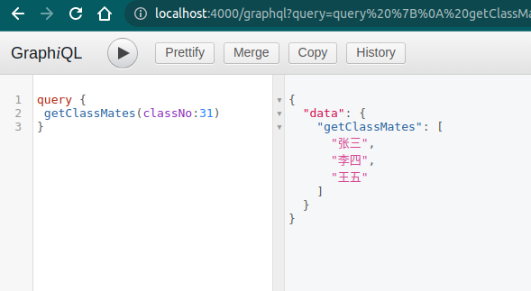

## 参数类型

### 基本类型

- String
- Int
- Float
- Boolean
- ID


### 复杂类型

- 数组: [], 如 [Int]


## 参数传递

```js
type Query {
    hello: String
    account: String
    age:Int
    users: [User]
}
```

除了像上面这样以`key:type` 的形式描述静态的查询 schema 之外， graphql 还支持传入一个函数的描述去作为 查询schema。用这种方式的好处在于你可以对单个字段的查询传递参数。


其语法和ts 很像

```js
type Query {
	rollDice(numDice: Int!, numSides: Int):[Int]
}
```

> `!` 表示参数不能为空

**示例**

```diff
  var express = require('express');
  var { graphqlHTTP } = require('express-graphql');
  var { buildSchema } = require('graphql');

  var schema = buildSchema(`
+   type Query {
+     getClassMates(classNo: Int!):[String]
+   }
  `);
  var root = {
+   getClassMates({ classNo }) {
+     const obj = {
+       31: ['张三', '李四', '王五'],
+       61: ['张大三', '李大四', '王大五'],
+     };
+     return obj[classNo];
+   },
  };

  var app = express();
  app.use(
    '/graphql',
    graphqlHTTP({
      schema: schema,
      rootValue: root,
      graphiql: true,
    }),
  );
  app.listen(4000, () =>
    console.log('Now browse to http://localhost:4000/graphql'),
  );
```



